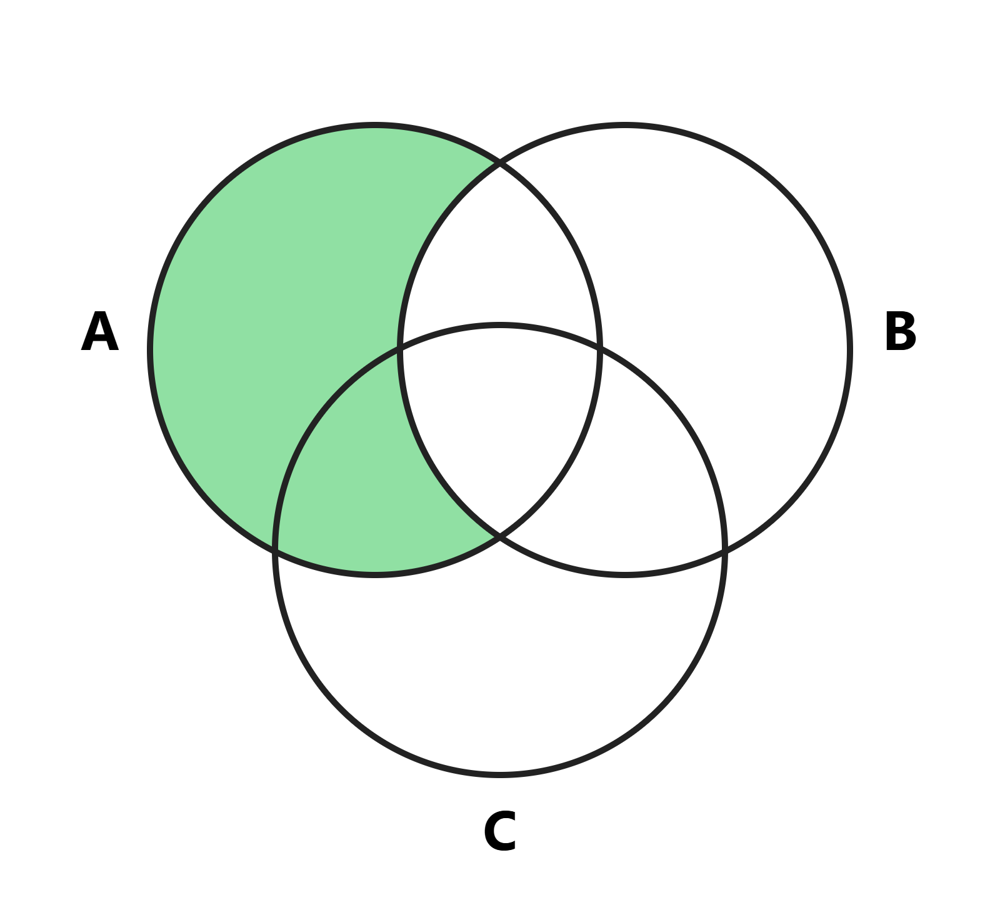

# VennMaker

An elegant, lightweight, and blazing-fast Venn Diagram generator designed specifically for students and professionals. Create perfect 2 or 3-set Venn diagrams with real-time math expression parsing and seamless copy-paste support for iPad and note-taking apps like Notability.

<picture>
  <source media="(prefers-color-scheme: dark)" srcset="promo/VennDiagramDemoDarkMode.png">
  <source media="(prefers-color-scheme: light)" srcset="promo/VennDiagramDemo.png">
  
</picture>

> **Built entirely using "Vibe Coding" with Gemini.** Driven by prompts, refined by grit, and optimized to bypass browser constraints.

---

## Features

- **Dynamic Math Parsing:** Instantly generates and colors specific regions based on logical expressions.
- **Dual Modes:** Supports both 2-circle and 3-circle symmetrical Venn diagrams.
- **Hi-Res iPad Export:** A custom-built, blur-filtered overlay solution tailored for iPadOS Safari, allowing flawless **Long-Press -> Copy** into apps like Notability or GoodNotes without losing resolution.
- **Vector Quality & Clean UI:** Pure SVG rendering inside the DOM with zero external CSS framework dependencies.

## Tech Stack & Architecture

- **Build Tool:** [Vite](https://vite.dev/) (Optimized for local network hosting via `--host`).
- **Frontend:** Vanilla JavaScript, Semantic HTML5, and raw CSS3.
- **Graphics:** Dynamic SVG compilation with custom XML serialization & HTML5 Canvas translation.

---

## Getting Started

To run the generator locally on your machine (and access it from your iPad/tablet via local Wi-Fi):

### 1. Clone the repository

```bash
git clone https://github.com/RoeiMeiri9/VennMaker.git
cd VennMaker
```

### 2. Install dependencies

```bash
npm install
```

### 3. Run the development server

```bash
npm run dev
```

_Note: Vite will provide a `Network:` URL. Open that URL on your iPad Safari to start creating and pasting diagrams directly into your notes!_

### 4. Build for production

```bash
npm run build
```

---

## License

This project is open-source and free to use under the [MIT License](./LICENSE). Feel free to fork, vibe-code, and improve it!
